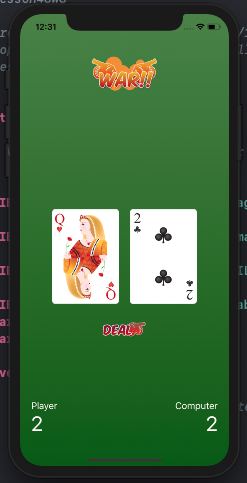

# :dart: Card-War :dart:
## Description
This game is actually a mini-project that I did for finishing CodeWithChris iOS training. This is the prototype, and I really want to continue this project, if I have the strong will :joy:. The game is a simple *gambling* game. You get a card, and if your card is bigger (in value) than the computer's card value, you get a point! It's really simple, but that's the basic core gameplay. I haven't added any cute stuff like main menu or game over stuff. I was thinking about adding a countdown tho, that would make the game more interesting, try tapping as much as you can and pray that you'll win. HAHAHAHAHAH

## Progress + Screenshot
**Wed, 7 Aug 2019** | I just made this, so it's still in its initial version, fresh off the boat. I'm going to add more mechanics later. :v:

